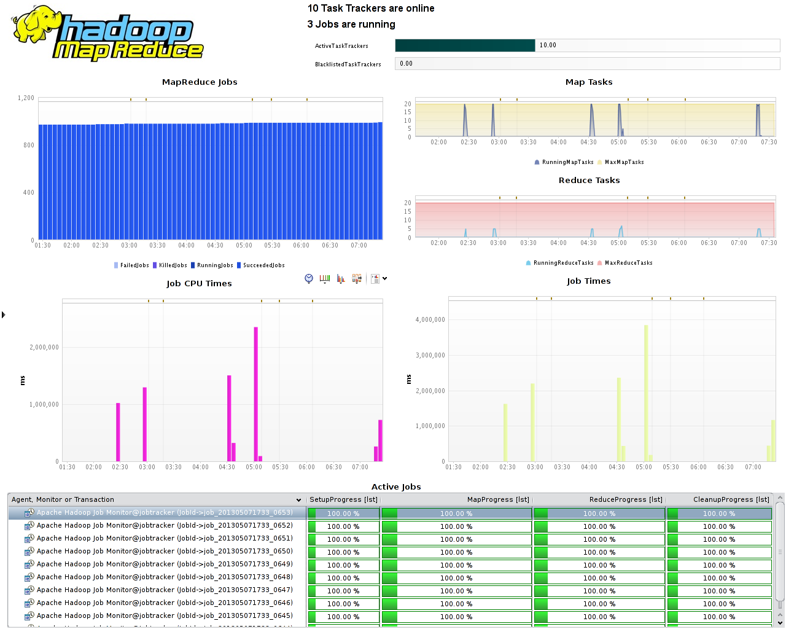

# Apache Hadoop and MapReduce FastPack

 Compuware APM dynaTrace 5.5 has [built-in support
for Hadoop MapReduce](https://community/display/DOCDT55/Hadoop+MapReduce). This FastPack provides additional dashboards and a Job Monitor for further monitoring and analysis.

## Fast Pack Details

| Name |Apache Hadoop FastPack
| :--- | :---
| Version | 5.5.0.5225, 5.6.0.5802
| dynaTrace Version | 5.5, 5.6
| Author | Michael Kopp
| License | [dynaTrace BSD](attachments_5275722_2_dynaTraceBSD.txt)
| Support | [Not Supported ](https://community.compuwareapm.com/community/display/DL/Support+Levels#SupportLevels-Community)

[Fastpack Download for dynaTrace 5.5](attachments_122978600_1_ApacheHadoopFastpack_5.5.dtp) contains:

  * MapReduce Jobs Dashboard 

  * Hadoop HDFS Statistics Dashboard 

  * Hadoop Cluster Overview Dashboard 

  * Two Hadoop Metric Groups for the Data and Name Nodes 

  * Job Monitor that works for all major Hadoop Versions 

  * Sensor and Profile are built-in with dynaTrace 5.5 

[Fastpack Download for dynaTrace 5.6](attachments_167215201_1_ApacheHadoopFastpack_5.6.0.5802.dtp) additionally contains support for:

  * Amazon EMR 1.0.3 

  * Cloudera 4.6.0 (MR1) 

  * Cloudera 4.3.0 (MR1 + MR2) 

  * Cloudera 4.0.0 (MR1) 

If you have any questions, please don't hesitate to ask in our [Plugins and Extension Forum](https://community/display/DTFORUM/Community+Plugins+and+Extensions).

## Hadoop MapReduce Jobs

The MapReduce Dashboard gives an overview of the currently running Jobs and how much the Hadoop Environment is utilized. In addition it shows the specific running and completed jobs (lower pane). This
dashboard relies on the Job Monitor.

## HDFS (NameNode) Statistics

The HDFS (NameNode) Statistics Dashboard gives an overview over the most important HDFS Nodes. It shows the summary as seen by the name node. In addition the user can put the metrics for specific data
nodes on separate dashboards if that is desired.  

## Hadoop Cluster Overview

The Hadoop Cluster Overview shows a consolidated view of the cluster resource usage over time. It gives a sense of how much CPU is consumed and the load average of the whole cluster. It does the same
for Disk and Network I/I as well as memory. It serves the same purpose as Ganglia dashboards do.

## FastPack Information

dynaTrace 5.5. has [Hadoop MapReduce support](https://community/display/DOCDT55/Hadoop+MapReduce) built in. This fastpack contains three additional Dashboards, a Job Monitor and two Metric Groups for
the Name Node and Data Node respectively. dynaTrace can monitor any JMX attribute available withing the Hadoop nodes in addition to those supplied in this fastpack.

## Installation

You should first inject Agents into your Hadoop environment and create a new system profile. See [the documentation](https://community.compuwareapm.com/community/display/DOCDT55/Hadoop+MapReduce) on
how to do this.

Next just download and import the FastPack on your dynaTrace Server (see [Plugin Management](https://community.compuwareapm.com/community/display/DOCDT55/Plugin+Management)).

As a last step setup the Job Monitor, give it the name "Apache Hadoop Job Monitor" to make all dashboards work out of the box.

